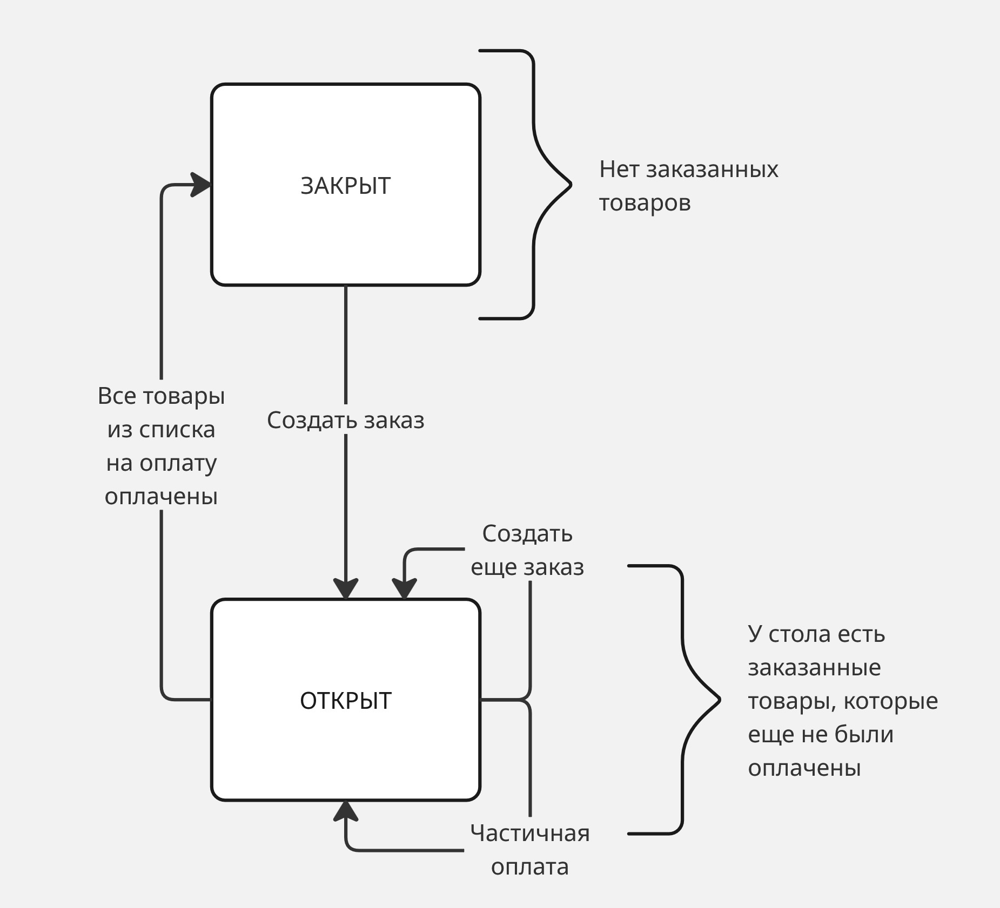
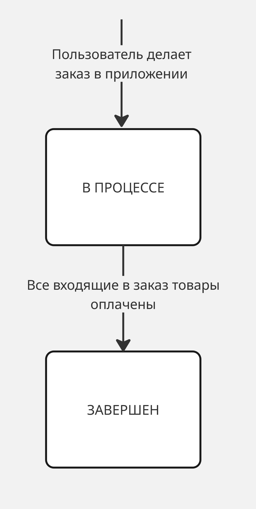

# TipTop

## Продуктовое описание

TipTop — веб-сервис для цифровизации обслуживания в кафе или ресторане. 
Посетители выбирают, заказывают, оплачивают заказ и оставляют чаевые через веб-приложение, доступное по QR-коду.
Официанты отслеживают заказы и заявки посетителей.
Менеджеры получают статистику по обслуживанию и продажам в своих заведениях.

### Функциональные требования

#### Ролевая модель

|№ | Пользователь | Авторизаиция |
|---|---|---|
|1| Посетитель | -|
|2|Официант |+ |
|3| Менеджер заведения| +| 
|4|Администратор TipTop | +|

#### Действия посетителя

|№ | Действие | Опциональное поддействие |
|---|---|---|
|1| Просмотреть информацию о блюдах в меню | Отфильтровать блюда по категории (Горячее, десерт и т.д.) |
|2| Выбрать блюда из меню и добавить их в корзину | - |
|3| Просмотреть корзину | - |
|4 | Удалить блюда из корзины | - |
|5| Выбрать блюда из корзины и заказать их |  Указать пожелания к заказу | 
|6| Выбрать блюда из меню оплаты и оплатить их | Оставить чаевые|
|7| Вызвать официанта | - |

- Чаевые адресуются привязанному к столу в данный момент официанту

#### Действия официанта

- Авторизоваться  
- Просмотреть информацию по своим столам   
- Просмотреть информацию по заявкам  

Особенности:
- Официант связывается со столом в момент совершения на столе первого заказа. Официант остается привязанным к столу до тех пор, пока все заказанные товары не будут оплачены. Связывание происходит автоматически с наименее занятым в данный момент официантом  
- Если пользователь не сделал ни одного заказа и создал заявку на вызов официанта, то она адресуется наименее занятому в данным момент официанту
- Если вызов официанта поступает со стола с активным привязанным официантом, то он адресуется именно ему
- Данные для авторизации официант получает от менеджера заведения. Пароль генерируется автоматически при создании аккаунта. Сотрудник может сменить пароль в профиле  

#### Действия менеджера заведения

- Авторизоваться  
- Добавить в меню блюдо  
- Удалить блюда из меню  
- Удалить блюда из меню  
- Заполнить информацию о заведении  
- Создать учетную запись для официанта  
- Удалить учетную запись для официанта  
- Создать QR-код для стола заведения  
- Удалить QR-код для стола заведения  
- Просмотреть статистику по заведению  

Особенности:
- Данные для авторизации менеджер получает от администратора TipTop. Пароль генерируется автоматически при создании аккаунта. Менеджер может сменить пароль в профиле

#### Администратор TipTop

- Авторизоваться
- Создать учетную запись для менеджера заведения
- Получить статистику по заведениям
- Удалить учетную запись для менеджера заведения 

### Интеграции

#### Платежный шлюз ЮКасса

Для имитации платежных операций будет использована интеграция с песочницей от ЮКасса.
Песочница позволяет имитировать реальные финансовые операции, интеграцию с реальным API без необходимости регистрации реальных расчетных счетов.

#### Telegram-бот

> [!NOTE]
> Закладывается, что данный функционал может быть не включен в финальную версию MVP-проекта

Официанты получают уведомления о заявках и заказах через телеграм-бот.

## Глоссарий

### ER-диаграмма

Для сущностей отражены только основные атрибуты

## Заведение

Одна учетная запись менеджера соответствует одному заведению.
В случае, если один пользователь-менеджер владеет несколькими заведениями, то для каждого из них создается своя учетная запись.

## Стол

У стола есть состояние, связанное с наличием заказанных или оплаченных товаров.

Статусы стола:
- **Свободен** — нет активного заказа, стол доступен для посетителей
- **Не оплачен** — есть заказ с неоплаченными позициями
- **Оплачен** — все позиции оплачены, стол готов к закрытию официантом

Схема состояний стола

* Сущность "сессия стола" отдельно не выделятся
* Стол переходит в состояние "закрыт" только после подтверждения официантом (кнопка "Закрыть стол"). Все позиции должны быть оплачены — это предусловие для закрытия. Кнопка закрытия неактивна, пока есть неоплаченные позиции
* Число посетителей на стол не регулируется в рамках сервиса
* Посетитель может переходить по QR-коду сколь угодно много раз

## Заказ

Схема состояний заказа

* Заказ не может быть отменен
* За одну сессию стола создаётся только один заказ. Если посетитель заказывает дополнительные блюда — они добавляются в существующий заказ

## Транзакция

* За один раз (за одну транзакцию) пользователь может оплатить вариативное число позиций из списка на оплату
* Транзакция создается при инициации оплаты выбранных позиций до отправки запроса в платежный шлюз
* Идемпотентность платежных операций поддерживается за счет ввода уникальный идентификаторов транзакций
* В случае ошибки при проведении оплаты в платежном шлюзе, информация об ошибке фиксируется в системе и пользователю предлагается повторить оплату, транзакция при этом не пересоздается
